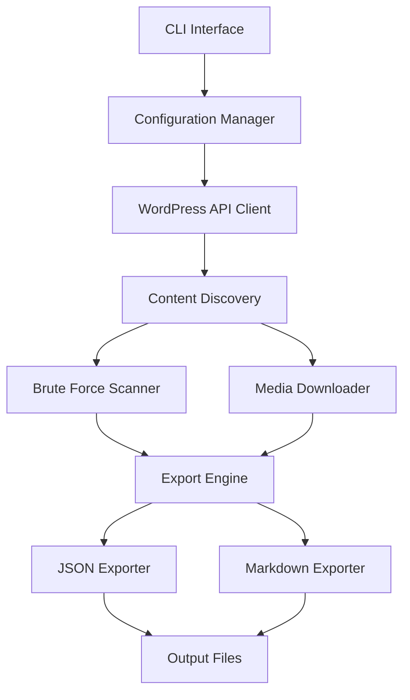

# WordPress Export JSON

[](https://golang.org/)
[](LICENSE)
[](https://github.com/tradik/wpexportjson)
[](https://goreportcard.com/)

A comprehensive WordPress content export toolkit with two powerful applications:

- **wpexportjson** - REST API based exporter with brute force content discovery
- **wpxmlrpc** - XML-RPC based exporter for authenticated access

Both tools export content to JSON or Markdown format with full media download support.

## Features

### wpexportjson (REST API Client)
- 🔍 **Complete Content Discovery**: Scans WordPress REST API for posts, pages, and media
- 🚀 **Brute Force Mode**: Attempts to discover unlisted content by ID enumeration
- 📁 **Multiple Export Formats**: JSON and Markdown output support
- 🖼️ **Media Download**: Downloads images and videos with content
- ⚡ **Concurrent Processing**: Fast parallel downloads and processing
- 📊 **Progress Tracking**: Real-time progress bars and status updates
- 🛠️ **Configurable**: Flexible configuration options via CLI or config file
- 🌐 **No Authentication**: Works with public WordPress REST API

### wpxmlrpc (XML-RPC Client)
- 🔐 **Authenticated Access**: Access private content with WordPress credentials
- 📜 **Legacy Support**: Works with older WordPress versions
- 🔒 **Secure Authentication**: Username/password or application passwords
- 📊 **Complete Export**: Posts, pages, media, categories, tags, and users
- 📁 **Multiple Formats**: JSON and Markdown export support
- 🛡️ **XML-RPC Protocol**: Direct WordPress XML-RPC API integration

## Installation

### From Source

```bash
git clone https://github.com/tradik/wpexportjson.git
cd wpexportjson
make build
```

### Using Go Install

```bash
go install github.com/tradik/wpexportjson/cmd/wpexportjson@latest
```

## Quick Start

### REST API Export (wpexportjson)
```bash
# Export all content from a WordPress site
wpexportjson export --url https://example.com --output ./export

# Export with brute force discovery
wpexportjson export --url https://example.com --brute-force --output ./export

# Export to specific format
wpexportjson export --url https://example.com --format json --output ./export.json
```

### XML-RPC Export (wpxmlrpc)
```bash
# Export with authentication
wpxmlrpc export --url https://example.com --username admin --password mypassword --output ./xmlrpc-export

# Export to markdown format
wpxmlrpc export --url https://example.com --username admin --password mypassword --format markdown --output ./markdown-export
```

## Usage

### Basic Export

```bash
wpexportjson export --url https://your-wordpress-site.com
```

### Advanced Options

```bash
wpexportjson export \
  --url https://your-wordpress-site.com \
  --format markdown \
  --output ./my-export \
  --brute-force \
  --max-id 10000 \
  --download-media \
  --concurrent 10
```

### Configuration File

Create a `config.yaml` file:

```yaml
url: "https://your-wordpress-site.com"
output: "./export"
format: "json"
brute_force: true
max_id: 10000
download_media: true
concurrent: 10
```

Then run:

```bash
wpexportjson export --config config.yaml
```

## Command Line Options

| Option | Description | Default |
|--------|-------------|---------|
| `--url` | WordPress site URL | Required |
| `--output` | Output directory or file | `./export` |
| `--format` | Export format (json/markdown) | `json` |
| `--brute-force` | Enable brute force ID discovery | `false` |
| `--max-id` | Maximum ID for brute force | `10000` |
| `--download-media` | Download images and videos | `true` |
| `--concurrent` | Concurrent downloads | `5` |
| `--config` | Configuration file path | - |

## Development

### Prerequisites

- Go 1.24 or later
- Make

### Setup

```bash
# Clone the repository
git clone https://github.com/tradik/wpexportjson.git
cd wpexportjson

# Install dependencies
make deps

# Install development tools
make dev-install

# Run in development mode
make dev
```

### Building

```bash
# Build for current platform
make build

# Build release binaries for all platforms
make release
```

### Testing

```bash
# Run tests
make test

# Run linter
make lint

# Format code
make format
```

## Project Structure

```
wpexportjson/
├── cmd/
│   └── wpexportjson/        # CLI application entry point
├── internal/
│   ├── api/                 # WordPress API client
│   ├── export/              # Export functionality
│   ├── media/               # Media download handling
│   └── config/              # Configuration management
├── pkg/
│   └── models/              # Data models
├── Makefile                 # Build automation
├── go.mod                   # Go module definition
└── README.md               # This file
```

## Architecture



## Contributing

1. Fork the repository
2. Create your feature branch (`git checkout -b feature/amazing-feature`)
3. Commit your changes (`git commit -m 'Add some amazing feature'`)
4. Push to the branch (`git push origin feature/amazing-feature`)
5. Open a Pull Request

## License

This project is licensed under the MIT License - see the [LICENSE](LICENSE) file for details.

## Changelog

See [CHANGELOG.md](CHANGELOG.md) for a list of changes and version history.
