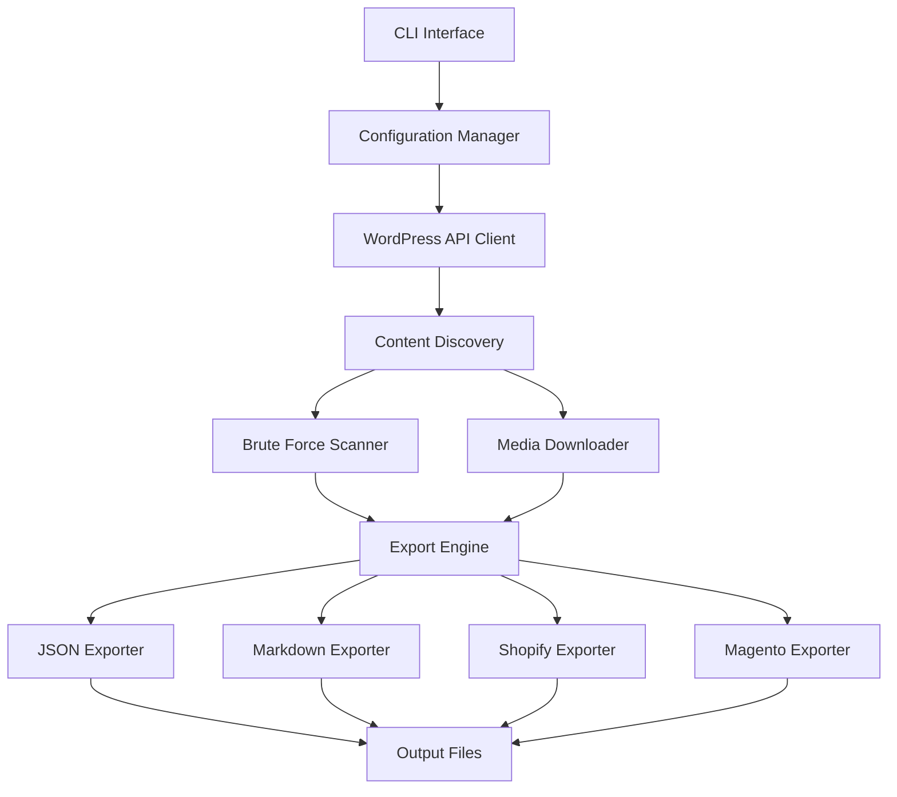

# WordPress Export JSON

[](https://golang.org/)
[](LICENSE)
[](https://github.com/tradik/wpexporter/pkgs/container/wpexporter)
[](https://github.com/tradik/wpexporter/actions/workflows/ci.yml)
[](https://github.com/tradik/wpexporter/releases/latest)
[](https://goreportcard.com/report/github.com/tradik/wpexporter)

A comprehensive WordPress content export toolkit with two powerful applications:

- **wpexportjson** - REST API based exporter with brute force content discovery
- **wpxmlrpc** - XML-RPC based exporter for authenticated access

Both tools export content to JSON, Markdown, **Shopify-compatible CSV**, or **Magento-compatible CSV** format with full media download support.

## Features

### wpexporter (REST API Client)
- 🔍 **Complete Content Discovery**: Scans WordPress REST API for posts, pages, and media
- 🚀 **Brute Force Mode**: Attempts to discover unlisted content by ID enumeration
- 📁 **Multiple Export Formats**: JSON, Markdown, Shopify CSV, and Magento CSV output support
- 🛒 **Shopify Integration**: Export directly to Shopify-compatible product CSV format
- 🏪 **Magento Integration**: Export directly to Magento 2-compatible product CSV format
- � **WooCommerce Support**: Detects and exports WooCommerce products automatically
- 🧹 **Content Filtering**: Control what to export with `--no-posts`, `--no-pages`, and `--no-products` flags
- �🖼️ **Media Download**: Downloads images and videos with content
- ⚡ **Concurrent Processing**: Fast parallel downloads and processing
- 📊 **Progress Tracking**: Real-time progress bars and status updates
- 🛠️ **Configurable**: Flexible configuration options via CLI or config file
- 🌐 **No Authentication**: Works with public WordPress REST API

### wpxmlrpc (XML-RPC Client)
- 🔐 **Authenticated Access**: Access private content with WordPress credentials
- 📜 **Legacy Support**: Works with older WordPress versions
- 🔒 **Secure Authentication**: Username/password or application passwords
- 📊 **Complete Export**: Posts, pages, media, categories, tags, and users
- 📁 **Multiple Formats**: JSON and Markdown export support
- 🛡️ **XML-RPC Protocol**: Direct WordPress XML-RPC API integration

## Installation

### From Source

```bash
git clone https://github.com/tradik/wpexporter.git
cd wpexporter
make build
```

### Using Go Install

```bash
go install github.com/tradik/wpexporter/cmd/wpexporter@latest
```

### Using Docker

Docker images are available from GitHub Container Registry:

```bash
# Pull the latest image
docker pull ghcr.io/tradik/wpexporter:latest

# Run wpexporter
docker run --rm -v $(pwd)/export:/export ghcr.io/tradik/wpexporter:latest \
  wpexportjson export --url https://example.com --output /export

# Run wpxmlrpc
docker run --rm -v $(pwd)/export:/export ghcr.io/tradik/wpexporter:latest \
  wpxmlrpc export --url https://example.com --username admin --password mypassword --output /export
```

## Quick Start

### REST API Export (wpexporter)
```bash
# Export all content from a WordPress site
wpexportjson export --url https://example.com --output ./export

# Export with brute force discovery
wpexportjson export --url https://example.com --brute-force --output ./export

# Export to specific format
wpexportjson export --url https://example.com --format json --output ./export.json

# Export and create ZIP archive
wpexportjson export --url https://example.com --zip

# Export to ZIP only (remove files after creating ZIP)
wpexportjson export --url https://example.com --zip --no-files

# Export to Markdown with ZIP archive
wpexportjson export --url https://example.com -f markdown --zip

# Export to Shopify-compatible CSV format
wpexportjson export --url https://example.com -f shopify

# Export to Shopify CSV with ZIP archive
wpexportjson export --url https://example.com -f shopify --zip

# Export to Magento-compatible CSV format
wpexportjson export --url https://example.com -f magento

# Export to Magento CSV with ZIP archive
wpexportjson export --url https://example.com -f magento --zip
```

### XML-RPC Export (wpxmlrpc)
```bash
# Export with authentication
wpxmlrpc export --url https://example.com --username admin --password mypassword --output ./xmlrpc-export

# Export to markdown format
wpxmlrpc export --url https://example.com --username admin --password mypassword --format markdown --output ./markdown-export
```

## Usage

### Basic Export

```bash
wpexportjson export --url https://your-wordpress-site.com
```

### Advanced Options

```bash
wpexportjson export \
  --url https://your-wordpress-site.com \
  --format markdown \
  --output ./my-export \
  --brute-force \
  --max-id 10000 \
  --download-media \
  --concurrent 10
```

### Configuration File

Create a `config.yaml` file:

```yaml
url: "https://your-wordpress-site.com"
output: "./export"
format: "json"
brute_force: true
max_id: 10000
download_media: true
concurrent: 10
```

Then run:

```bash
wpexportjson export --config config.yaml
```

## Command Line Options

| Option | Description | Default |
|--------|-------------|---------|
| `--url` | WordPress site URL | Required |
| `--output` | Output directory or file | `./export` |
| `--format` | Export format (json/markdown/shopify/magento) | `json` |
| `--brute-force` | Enable brute force ID discovery | `false` |
| `--max-id` | Maximum ID for brute force | `10000` |
| `--download-media` | Download images and videos | `true` |
| `--concurrent` | Concurrent downloads | `5` |
| `--zip` | Create ZIP archive of export | `false` |
| `--no-files` | Remove export files after creating ZIP (requires --zip) | `false` |
| `--no-posts` | Skip exporting blog posts | `false` |
| `--no-pages` | Skip exporting pages | `false` |
| `--no-products` | Skip exporting WooCommerce products | `false` |
| `--config` | Configuration file path | - |

## Development

### Prerequisites

- Go 1.25 or later
- Make

### Setup

```bash
# Clone the repository
git clone https://github.com/tradik/wpexporter.git
cd wpexporter

# Install dependencies
make deps

# Install development tools
make dev-install

# Run in development mode
make dev
```

### Building

```bash
# Build for current platform
make build

# Build release binaries for all platforms
make release
```

### Testing

```bash
# Run tests
make test

# Run linter
make lint

# Format code
make format
```

## Project Structure

```
wpexporter/
├── cmd/
│   └── wpexporter/        # CLI application entry point
├── internal/
│   ├── api/                 # WordPress API client
│   ├── export/              # Export functionality
│   ├── media/               # Media download handling
│   └── config/              # Configuration management
├── pkg/
│   └── models/              # Data models
├── Makefile                 # Build automation
├── go.mod                   # Go module definition
└── README.md               # This file
```

## Architecture


```mermaid
graph TB
    A[CLI Interface] --> B[Configuration Manager]
    B --> C[WordPress API Client]
    C --> D[Content Discovery]
    D --> E[Brute Force Scanner]
    D --> F[Media Downloader]
    E --> G[Export Engine]
    F --> G
    G --> H[JSON Exporter]
    G --> I[Markdown Exporter]
    G --> K[Shopify Exporter]
    G --> L[Magento Exporter]
    H --> J[Output Files]
    I --> J
    K --> J
    L --> J
```

## Shopify Export Format

The Shopify export format generates CSV files compatible with Shopify's product import system. This allows you to migrate WordPress content (posts, pages) to Shopify as products.

### Output Files

When exporting to Shopify format, the following files are generated:

| File | Description |
|------|-------------|
| `shopify_posts.csv` | WordPress posts exported as Shopify products |
| `shopify_pages.csv` | WordPress pages exported as Shopify products |
| `shopify_products.csv` | Combined posts and pages as products |
| `shopify_metadata.csv` | Site metadata and export statistics |

### CSV Column Mapping

WordPress content is mapped to Shopify product fields as follows:

| WordPress Field | Shopify Field |
|-----------------|---------------|
| Post Slug | Handle |
| Post Title | Title |
| Post Content (HTML) | Body (HTML) |
| Author Name | Vendor |
| First Category | Type |
| Tags | Tags (comma-separated) |
| Post Status | Published (TRUE/FALSE) |
| Featured Image | Image Src |
| Post Excerpt | SEO Description |
| Post ID | Variant SKU (format: WP-{id}) |

### Usage Example

```bash
# Export WordPress content to Shopify format
wpexportjson export --url https://your-wordpress-site.com -f shopify

# Export to Shopify and create ZIP for easy upload
wpexportjson export --url https://your-wordpress-site.com -f shopify --zip
```

### Importing to Shopify

1. Log in to your Shopify Admin
2. Go to **Products** > **Import**
3. Click **Add file** and select `shopify_products.csv`
4. Review the import preview
5. Click **Import products**

> **Note**: The exported CSV follows Shopify's official product CSV format. For best results, review the [Shopify CSV import documentation](https://help.shopify.com/en/manual/products/import-export/using-csv).

## Magento Export Format

The Magento export format generates CSV files compatible with Magento 2's product import system. This allows you to migrate WordPress content (posts, pages) to Magento as simple products.

### Output Files

When exporting to Magento format, the following files are generated:

| File | Description |
|------|-------------|
| `magento_posts.csv` | WordPress posts exported as Magento products |
| `magento_pages.csv` | WordPress pages exported as Magento products |
| `magento_products.csv` | Combined posts and pages as products |
| `magento_metadata.csv` | Site metadata and export statistics |

### CSV Column Mapping

WordPress content is mapped to Magento product fields as follows:

| WordPress Field | Magento Field |
|-----------------|---------------|
| Post Slug (uppercase) | sku |
| Post Title | name |
| Post Content (HTML) | description |
| Post Excerpt | short_description |
| Categories | categories (Default Category/Name format) |
| Tags | meta_keywords |
| Post Slug | url_key |
| Post Title | meta_title |
| Post Excerpt | meta_description |
| Featured Image | base_image, small_image, thumbnail_image |
| Post Status | product_online (1=enabled, 0=disabled) |

### Usage Example

```bash
# Export WordPress content to Magento format
wpexportjson export --url https://your-wordpress-site.com -f magento

# Export to Magento and create ZIP for easy upload
wpexportjson export --url https://your-wordpress-site.com -f magento --zip
```

### Importing to Magento 2

1. Log in to your Magento 2 Admin Panel
2. Go to **System** > **Data Transfer** > **Import**
3. Select **Products** as Entity Type
4. Choose **Add/Update** as Import Behavior
5. Upload `magento_products.csv`
6. Click **Check Data** to validate
7. Click **Import** to complete

> **Note**: Before importing, ensure image files are uploaded to `/pub/media/import/` on your Magento server. For best results, review the [Magento 2 CSV import documentation](https://experienceleague.adobe.com/docs/commerce-admin/systems/data-transfer/import/data-import.html).

## Contributing

1. Fork the repository
2. Create your feature branch (`git checkout -b feature/amazing-feature`)
3. Commit your changes (`git commit -m 'Add some amazing feature'`)
4. Push to the branch (`git push origin feature/amazing-feature`)
5. Open a Pull Request

## License

This project is dual-licensed under the **MIT License** and **BSD 3-Clause License**.
See the [LICENSE](LICENSE) file for full license texts and choose the one that best fits your use case.

## Changelog

See [CHANGELOG.md](CHANGELOG.md) for a list of changes and version history.
