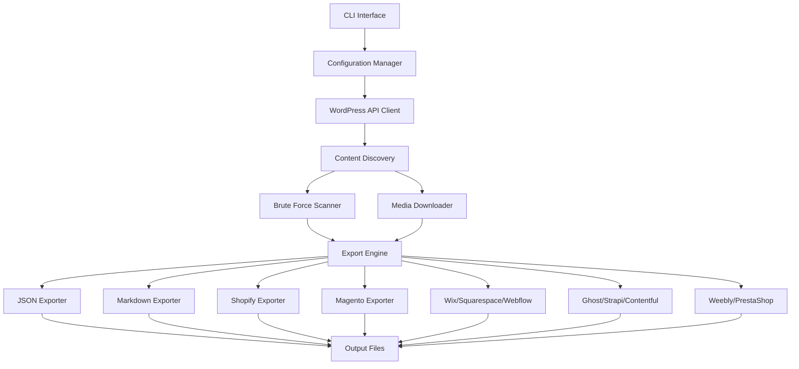

# WordPress Export JSON

[](https://golang.org/)
[](LICENSE)
[](https://github.com/tradik/wpexporter/pkgs/container/wpexporter)
[](https://github.com/tradik/wpexporter/actions/workflows/ci.yml)
[](https://github.com/tradik/wpexporter/releases/latest)
[](https://goreportcard.com/report/github.com/tradik/wpexporter)
[](https://github.com/tradik/wpexporter/stargazers)
[](https://github.com/tradik/wpexporter/network/members)
[](https://github.com/tradik/wpexporter/issues)

> **Repository:** [github.com/tradik/wpexporter](https://github.com/tradik/wpexporter)

A comprehensive WordPress content export toolkit with two powerful applications:

- **wpexportjson** - REST API based exporter with brute force content discovery
- **wpxmlrpc** - XML-RPC based exporter for authenticated access

**Export to 14+ popular platforms** including e-commerce systems ([Shopify](https://www.shopify.com/), [Magento](https://business.adobe.com/products/magento/magento-commerce.html), [PrestaShop](https://www.prestashop.com/)), traditional CMS platforms ([WordPress](https://wordpress.org/), [Drupal](https://www.drupal.org/), [Wix](https://www.wix.com/), [Squarespace](https://www.squarespace.com/), [Webflow](https://webflow.com/), [Weebly](https://www.weebly.com/)), and headless CMS solutions ([Ghost](https://ghost.org/), [Strapi](https://strapi.io/), [Contentful](https://www.contentful.com/)), plus JSON and Markdown formats with full media download support.

## Features

### wpexporter (REST API Client)
- 🔍 **Complete Content Discovery**: Scans WordPress REST API for posts, pages, and media
- 🚀 **Brute Force Mode**: Attempts to discover unlisted content by ID enumeration
- 📁 **Multiple Export Formats**: JSON, Markdown, Shopify, Magento, WordPress, Drupal, Wix, Squarespace, Webflow, Weebly, PrestaShop, Ghost, Strapi, and Contentful
- 🛒 **E-commerce Integration**: Export to [Shopify](https://www.shopify.com/), [Magento](https://business.adobe.com/products/magento/magento-commerce.html), [PrestaShop](https://www.prestashop.com/) CSV formats
- 🌐 **CMS Migration**: Export to [WordPress](https://wordpress.org/), [Drupal](https://www.drupal.org/), [Wix](https://www.wix.com/), [Squarespace](https://www.squarespace.com/), [Webflow](https://webflow.com/), [Weebly](https://www.weebly.com/)
- 📝 **Headless CMS Support**: Export to [Ghost](https://ghost.org/), [Strapi](https://strapi.io/), [Contentful](https://www.contentful.com/) JSON formats
- 🛍️ **WooCommerce Support**: Detects and exports WooCommerce products automatically
- 🧹 **Content Filtering**: Control what to export with `--no-posts`, `--no-pages`, and `--no-products` flags
- 🖼️ **Media Download**: Downloads images and videos with content
- ⚡ **Concurrent Processing**: Fast parallel downloads and processing
- 📊 **Progress Tracking**: Real-time progress bars and status updates
- 🛠️ **Configurable**: Flexible configuration options via CLI or config file
- 🌐 **No Authentication**: Works with public WordPress REST API

### wpxmlrpc (XML-RPC Client)
- 🔐 **Authenticated Access**: Access private content with WordPress credentials
- 📜 **Legacy Support**: Works with older WordPress versions
- 🔒 **Secure Authentication**: Username/password or application passwords
- 📊 **Complete Export**: Posts, pages, media, categories, tags, and users
- 📁 **Multiple Formats**: JSON and Markdown export support
- 🛡️ **XML-RPC Protocol**: Direct WordPress XML-RPC API integration

## Installation

### From Source

```bash
git clone https://github.com/tradik/wpexporter.git
cd wpexporter
make build
```

### Using Go Install

```bash
go install github.com/tradik/wpexporter/cmd/wpexporter@latest
```

### Using Docker

Docker images are available from GitHub Container Registry:

```bash
# Pull the latest image
docker pull ghcr.io/tradik/wpexporter:latest

# Run wpexporter
docker run --rm -v $(pwd)/export:/export ghcr.io/tradik/wpexporter:latest \
  wpexportjson export --url https://example.com --output /export

# Run wpxmlrpc
docker run --rm -v $(pwd)/export:/export ghcr.io/tradik/wpexporter:latest \
  wpxmlrpc export --url https://example.com --username admin --password mypassword --output /export
```

## Quick Start

### REST API Export (wpexporter)
```bash
# Export all content from a WordPress site
wpexportjson export --url https://example.com --output ./export

# Export with brute force discovery
wpexportjson export --url https://example.com --brute-force --output ./export

# Export to specific format
wpexportjson export --url https://example.com --format json --output ./export.json

# Export and create ZIP archive
wpexportjson export --url https://example.com --zip

# Export to ZIP only (remove files after creating ZIP)
wpexportjson export --url https://example.com --zip --no-files

# Export to Markdown with ZIP archive
wpexportjson export --url https://example.com -f markdown --zip

# Export to Shopify-compatible CSV format
wpexportjson export --url https://example.com -f shopify

# Export to Shopify CSV with ZIP archive
wpexportjson export --url https://example.com -f shopify --zip

# Export to Magento-compatible CSV format
wpexportjson export --url https://example.com -f magento

# Export to Magento CSV with ZIP archive
wpexportjson export --url https://example.com -f magento --zip

# Export to WordPress WXR format (for WordPress import)
wpexportjson export --url https://example.com -f wordpress

# Export to Drupal-compatible JSON format
wpexportjson export --url https://example.com -f drupal

# Export to Wix-compatible JSON format
wpexportjson export --url https://example.com -f wix

# Export to Squarespace-compatible XML format
wpexportjson export --url https://example.com -f squarespace

# Export to Webflow-compatible CSV format
wpexportjson export --url https://example.com -f webflow

# Export to Weebly-compatible format (XML + JSON)
wpexportjson export --url https://example.com -f weebly

# Export to PrestaShop-compatible CSV format
wpexportjson export --url https://example.com -f prestashop

# Export to Ghost-compatible JSON format
wpexportjson export --url https://example.com -f ghost

# Export to Strapi-compatible JSON format
wpexportjson export --url https://example.com -f strapi

# Export to Contentful-compatible JSON format
wpexportjson export --url https://example.com -f contentful
```

### XML-RPC Export (wpxmlrpc)
```bash
# Export with authentication
wpxmlrpc export --url https://example.com --username admin --password mypassword --output ./xmlrpc-export

# Export to markdown format
wpxmlrpc export --url https://example.com --username admin --password mypassword --format markdown --output ./markdown-export
```

## Usage

### Basic Export

```bash
wpexportjson export --url https://your-wordpress-site.com
```

### Advanced Options

```bash
wpexportjson export \
  --url https://your-wordpress-site.com \
  --format markdown \
  --output ./my-export \
  --brute-force \
  --max-id 10000 \
  --download-media \
  --concurrent 10
```

### Configuration File

Create a `config.yaml` file:

```yaml
url: "https://your-wordpress-site.com"
output: "./export"
format: "json"
brute_force: true
max_id: 10000
download_media: true
concurrent: 10
```

Then run:

```bash
wpexportjson export --config config.yaml
```

## Command Line Options

<table>
<thead>
<tr>
<th style="white-space:nowrap">Option</th>
<th>Description</th>
<th>Default</th>
</tr>
</thead>
<tbody>
<tr><td><code>--url</code></td><td>WordPress site URL</td><td>Required</td></tr>
<tr><td><code>--output</code></td><td>Output directory or file</td><td><code>./export</code></td></tr>
<tr><td><code>--format</code></td><td>Export format (json/ markdown/ shopify/ magento/ wordpress/ drupal/ wix/ squarespace/ webflow/ weebly/ prestashop/ ghost/ strapi/ contentful)</td><td><code>json</code></td></tr>
<tr><td><code>--brute-force</code></td><td>Enable brute force ID discovery</td><td><code>false</code></td></tr>
<tr><td><code>--max-id</code></td><td>Maximum ID for brute force</td><td><code>10000</code></td></tr>
<tr><td><code>--download-media</code></td><td>Download images and videos</td><td><code>true</code></td></tr>
<tr><td><code>--no-media</code></td><td>Disable media downloads (alias for --download-media=false)</td><td><code>false</code></td></tr>
<tr><td><code>--relevant-media-only</code></td><td>Download only featured images and content images</td><td><code>false</code></td></tr>
<tr><td><code>--concurrent</code></td><td>Concurrent downloads</td><td><code>5</code></td></tr>
<tr><td><code>--zip</code></td><td>Create ZIP archive of export</td><td><code>false</code></td></tr>
<tr><td><code>--no-files</code></td><td>Remove export files after creating ZIP (requires --zip)</td><td><code>false</code></td></tr>
<tr><td><code>--no-posts</code></td><td>Skip exporting blog posts</td><td><code>false</code></td></tr>
<tr><td><code>--no-pages</code></td><td>Skip exporting pages</td><td><code>false</code></td></tr>
<tr><td><code>--no-products</code></td><td>Skip exporting WooCommerce products</td><td><code>false</code></td></tr>
<tr><td><code>--no-users</code></td><td>Skip exporting users</td><td><code>false</code></td></tr>
<tr><td><code>--no-tags</code></td><td>Skip exporting tags</td><td><code>false</code></td></tr>
<tr><td><code>--path-filter</code></td><td>Filter posts/pages by URL path pattern (e.g., /fr/arts/)</td><td>-</td></tr>
<tr><td><code>--flat-html</code></td><td>Convert HTML to Markdown (Bricks Builder, Elementor support)</td><td><code>false</code></td></tr>
<tr><td><code>--assisted-crawl</code></td><td>Crawl URLs to extract SEO metadata (title, description, og tags)</td><td><code>false</code></td></tr>
<tr><td><code>--crawl-content</code></td><td>Crawl pages with empty content (Bricks, Elementor page builders)</td><td><code>false</code></td></tr>
<tr><td><code>--skip-empty-content</code></td><td>Skip posts/pages with empty content from export</td><td><code>false</code></td></tr>
<tr><td><code>--auth-user</code></td><td>Username for Basic Auth (prompts for password if --auth-pass not provided)</td><td>-</td></tr>
<tr><td><code>--auth-pass</code></td><td>Password for Basic Auth</td><td>-</td></tr>
<tr><td><code>--auth-token</code></td><td>Bearer token for authentication</td><td>-</td></tr>
<tr><td><code>--rate-limit</code></td><td>Delay between API requests in milliseconds (prevents server rate limiting)</td><td><code>0</code></td></tr>
<tr><td><code>--resume</code></td><td>Resume from checkpoint if previous export was interrupted</td><td><code>false</code></td></tr>
<tr><td><code>--timeout</code></td><td>HTTP request timeout in seconds (increase for slow servers)</td><td><code>30</code></td></tr>
<tr><td><code>--verbose</code>, <code>-v</code></td><td>Enable verbose output</td><td><code>false</code></td></tr>
<tr><td><code>--quiet</code>, <code>-q</code></td><td>Suppress all output, only return exit code</td><td><code>false</code></td></tr>
<tr><td><code>--config</code></td><td>Configuration file path</td><td>-</td></tr>
</tbody>
</table>

## SEO Metadata Extraction

The `--assisted-crawl` option enables extraction of SEO metadata by crawling actual page URLs. This is useful when:

- RankMath, Yoast, or other SEO plugins are installed
- SEO data is not exposed via WordPress REST API
- You need accurate `<title>` tags and meta descriptions

### Extracted SEO Fields

| Field | Source |
|-------|--------|
| `seo_title` | `<title>` tag content |
| `meta_description` | `<meta name="description">` |
| `meta_keywords` | `<meta name="keywords">` |
| `og_title` | `<meta property="og:title">` |
| `og_description` | `<meta property="og:description">` |
| `og_image` | `<meta property="og:image">` |
| `canonical_url` | `<link rel="canonical">` |

### Usage Example

```bash
# Export with SEO metadata extraction
wpexportjson export --url https://example.com --assisted-crawl -f markdown

# Combine with path filter for specific sections
wpexportjson export --url https://example.com --path-filter=/blog/ --assisted-crawl -f markdown

# With authentication for protected sites
wpexportjson export --url https://example.com --auth-user admin --auth-pass secret --assisted-crawl

# With rate limiting to prevent server overload (500ms delay between requests)
wpexportjson export --url https://example.com --rate-limit 500 -f markdown

# Resume interrupted export (checkpoint is saved automatically)
wpexportjson export --url https://example.com --resume -f markdown
```

## Resume / Checkpoint Feature

When exporting large sites, the `--resume` flag enables automatic checkpoint saving. If the export is interrupted (network error, server timeout, etc.), you can resume from where it left off:

```bash
# First export attempt (interrupted at 90%)
wpexportjson export --url https://large-site.com --resume -f markdown
# Error: connection timeout...

# Resume from checkpoint
wpexportjson export --url https://large-site.com --resume -f markdown
# Resuming from checkpoint: export/large-site.com.2026-02-02/.wpexport_checkpoint.json
# Checkpoint: posts=1500 (done=true), pages=42 (done=false)...
```

The checkpoint file (`.wpexport_checkpoint.json`) is automatically deleted on successful completion.

## HTML to Markdown Conversion

The `--flat-html` option converts HTML content to clean Markdown format. This is useful for:

- Sites using page builders (Bricks Builder, Elementor) that output complex HTML
- Migrating content to markdown-based systems
- Cleaning up HTML before export

### Built-in Conversions

| HTML Element | Markdown Output |
|--------------|-----------------|
| `<h1>` - `<h6>` | `#` - `######` |
| `<p>` | Plain text with line breaks |
| `<strong>`, `<b>` | `**bold**` |
| `<em>`, `<i>` | `*italic*` |
| `<a href="...">` | `[text](url)` |
| `` | `` |
| `<ul>`, `<ol>` | `-` or `1.` lists |
| `<blockquote>` | `>` quote |
| `<code>` | `` `inline` `` |
| `<pre><code>` | ` ``` ` code block |
| `<hr>` | `---` |
| Bricks: `.brxe-heading` | `##` heading |
| Bricks: `.brxe-text` | paragraph |

### Custom Conversion Rules

You can define custom rules in your `config.yaml` for site-specific HTML classes:

```yaml
flat_html_rules:
  # Bricks Builder custom headings
  - class: "brxe-heading"
    tag: "div"
    markdown: "## {content}\n\n"

  # Elementor headings
  - class: "elementor-heading-title"
    markdown: "# {content}\n\n"

  # Custom paragraph class
  - class: "my-paragraph"
    markdown: "{content}\n\n"

  # Specific tag + class combination
  - class: "custom-quote"
    tag: "span"
    markdown: "> {content}\n\n"
```

**Rule fields:**
- `class` (required): CSS class to match
- `tag` (optional): HTML tag to match (e.g., "div", "span")
- `markdown`: Output template where `{content}` is replaced with the element's text

### Page Builder Configuration Examples

Below are complete configuration examples for popular WordPress page builders.

#### Bricks Builder

```yaml
# config-bricks.yaml
flat_html_rules:
  # Headings
  - class: "brxe-heading"
    tag: "div"
    markdown: "## {content}\n\n"
  - class: "brxe-heading"
    tag: "h1"
    markdown: "# {content}\n\n"
  - class: "brxe-heading"
    tag: "h2"
    markdown: "## {content}\n\n"
  - class: "brxe-heading"
    tag: "h3"
    markdown: "### {content}\n\n"

  # Text blocks
  - class: "brxe-text"
    markdown: "{content}\n\n"
  - class: "brxe-text-basic"
    markdown: "{content}\n\n"

  # Lists
  - class: "brxe-list"
    markdown: "{content}\n\n"

  # Buttons (extract as links)
  - class: "brxe-button"
    markdown: "[{content}]\n\n"

  # Code blocks
  - class: "brxe-code"
    markdown: "```\n{content}\n```\n\n"
```

#### Elementor

```yaml
# config-elementor.yaml
flat_html_rules:
  # Headings
  - class: "elementor-heading-title"
    markdown: "## {content}\n\n"
  - class: "elementor-size-large"
    markdown: "# {content}\n\n"
  - class: "elementor-size-medium"
    markdown: "## {content}\n\n"
  - class: "elementor-size-small"
    markdown: "### {content}\n\n"

  # Text widgets
  - class: "elementor-text-editor"
    markdown: "{content}\n\n"
  - class: "elementor-widget-text-editor"
    markdown: "{content}\n\n"

  # Buttons
  - class: "elementor-button-text"
    markdown: "[{content}]\n\n"

  # Lists
  - class: "elementor-icon-list-text"
    markdown: "- {content}\n"

  # Testimonials
  - class: "elementor-testimonial-content"
    markdown: "> {content}\n\n"
  - class: "elementor-testimonial-name"
    markdown: "**{content}**\n\n"

  # Tabs and accordions
  - class: "elementor-tab-title"
    markdown: "### {content}\n\n"
  - class: "elementor-tab-content"
    markdown: "{content}\n\n"
  - class: "elementor-accordion-title"
    markdown: "### {content}\n\n"
  - class: "elementor-accordion-content"
    markdown: "{content}\n\n"
```

#### Divi Builder

```yaml
# config-divi.yaml
flat_html_rules:
  # Module titles
  - class: "et_pb_module_header"
    markdown: "## {content}\n\n"

  # Text modules
  - class: "et_pb_text_inner"
    markdown: "{content}\n\n"

  # Blurb modules
  - class: "et_pb_blurb_content"
    markdown: "{content}\n\n"
  - class: "et_pb_blurb_title"
    markdown: "### {content}\n\n"

  # Buttons
  - class: "et_pb_button"
    markdown: "[{content}]\n\n"

  # Testimonials
  - class: "et_pb_testimonial_description"
    markdown: "> {content}\n\n"
  - class: "et_pb_testimonial_author"
    markdown: "**{content}**\n\n"

  # Tabs
  - class: "et_pb_tab_title"
    markdown: "### {content}\n\n"
  - class: "et_pb_tab_content"
    markdown: "{content}\n\n"

  # Toggle/Accordion
  - class: "et_pb_toggle_title"
    markdown: "### {content}\n\n"
  - class: "et_pb_toggle_content"
    markdown: "{content}\n\n"

  # Pricing tables
  - class: "et_pb_pricing_title"
    markdown: "### {content}\n\n"
  - class: "et_pb_pricing_content"
    markdown: "{content}\n\n"
```

#### Oxygen Builder

```yaml
# config-oxygen.yaml
flat_html_rules:
  # Headings
  - class: "ct-headline"
    markdown: "## {content}\n\n"
  - class: "ct-headline"
    tag: "h1"
    markdown: "# {content}\n\n"
  - class: "ct-headline"
    tag: "h2"
    markdown: "## {content}\n\n"
  - class: "ct-headline"
    tag: "h3"
    markdown: "### {content}\n\n"

  # Text blocks
  - class: "ct-text-block"
    markdown: "{content}\n\n"

  # Rich text
  - class: "ct-rich-text"
    markdown: "{content}\n\n"

  # Buttons
  - class: "ct-button"
    markdown: "[{content}]\n\n"

  # Links
  - class: "ct-link-text"
    markdown: "{content}\n\n"
```

#### GenerateBlocks

```yaml
# config-generateblocks.yaml
flat_html_rules:
  # Headlines
  - class: "gb-headline"
    markdown: "## {content}\n\n"
  - class: "gb-headline"
    tag: "h1"
    markdown: "# {content}\n\n"
  - class: "gb-headline"
    tag: "h2"
    markdown: "## {content}\n\n"
  - class: "gb-headline"
    tag: "h3"
    markdown: "### {content}\n\n"

  # Buttons
  - class: "gb-button"
    markdown: "[{content}]\n\n"
  - class: "gb-button-text"
    markdown: "{content}"
```

#### Combining Multiple Page Builders

If your site uses multiple page builders or plugins, you can combine rules:

```yaml
# config-combined.yaml
flat_html_rules:
  # Bricks Builder
  - class: "brxe-heading"
    markdown: "## {content}\n\n"
  - class: "brxe-text"
    markdown: "{content}\n\n"

  # Elementor
  - class: "elementor-heading-title"
    markdown: "## {content}\n\n"
  - class: "elementor-text-editor"
    markdown: "{content}\n\n"

  # WPBakery/Visual Composer
  - class: "vc_custom_heading"
    markdown: "## {content}\n\n"
  - class: "wpb_text_column"
    markdown: "{content}\n\n"

  # Gutenberg blocks
  - class: "wp-block-heading"
    markdown: "## {content}\n\n"
  - class: "wp-block-paragraph"
    markdown: "{content}\n\n"
  - class: "wp-block-quote"
    markdown: "> {content}\n\n"
```

### Usage Example

```bash
# Convert HTML to Markdown with default rules
wpexportjson export --url https://example.com --flat-html -f markdown

# With custom rules from config file
wpexportjson export --url https://example.com --flat-html --config config.yaml -f markdown

# Combine with content crawling for page builder sites
wpexportjson export --url https://example.com --crawl-content --flat-html -f markdown
```

### Markdown Frontmatter Output

When using `--assisted-crawl` with markdown format, SEO fields are included in the frontmatter:

```yaml
---
id: 123
title: "Original Post Title"
seo_title: "SEO Optimized Title | Site Name"
meta_description: "A compelling description for search engines..."
og_title: "Title for Social Sharing"
og_image: "https://example.com/social-image.jpg"
# ... other fields
---
```

## 📦 Gutenberg Blocks Support

WordPress Gutenberg editor stores content as HTML with special comment markers. Here's how wpexporter handles Gutenberg blocks:

### ✅ Standard Export Behavior

Gutenberg blocks export automatically in all formats:

| Content Type | Export Result |
|--------------|---------------|
| Standard blocks (paragraphs, headings, lists) | ✅ Exported as HTML content |
| Core blocks (quote, code, image, gallery) | ✅ Embedded HTML preserved |
| Custom blocks (plugins, themes) | ✅ Rendered HTML output |
| Block patterns & reusable blocks | ✅ Resolved to final HTML |

**No configuration needed** for JSON, WordPress WXR, or HTML-preserving formats.

### 🔄 Markdown Conversion with `--flat-html`

When exporting to Markdown format, use `--flat-html` to convert Gutenberg HTML to clean Markdown:

```bash
# Convert Gutenberg content to Markdown
wpexportjson export --url https://example.com --flat-html -f markdown
```

Common Gutenberg CSS classes for custom rules in `config.yaml`:

```yaml
flat_html_rules:
  # Core Gutenberg blocks
  - class: "wp-block-heading"
    markdown: "## {content}\n\n"
  - class: "wp-block-paragraph"
    markdown: "{content}\n\n"
  - class: "wp-block-quote"
    markdown: "> {content}\n\n"
  - class: "wp-block-code"
    markdown: "```\n{content}\n```\n\n"
  - class: "wp-block-preformatted"
    markdown: "```\n{content}\n```\n\n"
  - class: "wp-block-list"
    markdown: "{content}\n\n"
  - class: "wp-block-image"
    markdown: "{content}\n\n"

  # Extended blocks
  - class: "wp-block-pullquote"
    markdown: "> **{content}**\n\n"
  - class: "wp-block-verse"
    markdown: "*{content}*\n\n"
  - class: "wp-block-table"
    markdown: "{content}\n\n"
```

### 📋 Block Detection

The exporter preserves Gutenberg comment markers in HTML exports:
```html
<!-- wp:paragraph -->
<p>Content here...</p>
<!-- /wp:paragraph -->
```

These markers are stripped during Markdown conversion with `--flat-html`.

## 🖼️ Media URL Mapping

When downloading media with `--download-media`, the exporter rewrites URLs in exported content to point to local files.

### 📁 File Organization

Downloaded media files are stored in a structured format:

```
export/
├── posts/
│   └── my-post.md
├── pages/
│   └── about.md
└── media/
    ├── 123_featured-image.jpg
    ├── 124_inline-photo.png
    ├── 125_document.pdf
    └── 126_video.mp4
```

**Naming pattern:** `{media_id}_{original_filename}{extension}`

### 🔄 URL Rewriting

Absolute WordPress URLs are converted to relative local paths:

| Original URL | Rewritten Path |
|--------------|----------------|
| `https://example.com/wp-content/uploads/2025/01/photo.jpg` | `media/123_photo.jpg` |
| `https://example.com/wp-content/uploads/2025/01/photo-300x200.jpg` | `media/123_photo.jpg` |
| `https://example.com/wp-content/uploads/2025/01/photo-150x150.jpg` | `media/123_photo.jpg` |

### 📷 Size Variants

WordPress generates multiple image sizes (thumbnail, medium, large, full). The exporter:

1. ✅ Downloads the **original full-size** image
2. ✅ Rewrites **all size variant URLs** to point to the full-size local file
3. ✅ Handles `-{width}x{height}` suffixed URLs automatically

### 🎯 Selective Media with `--relevant-media-only`

For sites with large media libraries, use `--relevant-media-only` to download only used images:

```bash
wpexportjson export --url https://example.com --relevant-media-only -f markdown
```

**What gets downloaded:**

| Media Type | Downloaded | Condition |
|------------|------------|-----------|
| Featured images | ✅ Yes | Referenced by `featured_media` field |
| Content images | ✅ Yes | Found in `` tags within content |
| Excerpt images | ✅ Yes | Found in `` tags within excerpt |
| Unused library items | ❌ No | Not referenced by any post/page |
| PDFs, videos, documents | ❌ No | Only images are filtered |

**Benefits:**
- 📉 Significantly reduces export size
- ⚡ Faster export for content-heavy sites
- 🎯 Only relevant assets are included

### 💡 Examples

```bash
# Download all media (default)
wpexportjson export --url https://example.com -f markdown

# Download only featured images and content images
wpexportjson export --url https://example.com --relevant-media-only -f markdown

# Skip media download entirely
wpexportjson export --url https://example.com --no-media -f markdown

# Combine with path filter for targeted export
wpexportjson export --url https://example.com --path-filter=/blog/ --relevant-media-only -f markdown
```

## Development

### Prerequisites

- Go 1.25 or later
- Make

### Setup

```bash
# Clone the repository
git clone https://github.com/tradik/wpexporter.git
cd wpexporter

# Install dependencies
make deps

# Install development tools
make dev-install

# Run in development mode
make dev
```

### Building

```bash
# Build for current platform
make build

# Build release binaries for all platforms
make release
```

### Testing

```bash
# Run tests
make test

# Run linter
make lint

# Format code
make format
```

## Project Structure

```
wpexporter/
├── cmd/
│   └── wpexporter/        # CLI application entry point
├── internal/
│   ├── api/                 # WordPress API client
│   ├── export/              # Export functionality
│   ├── media/               # Media download handling
│   └── config/              # Configuration management
├── pkg/
│   └── models/              # Data models
├── Makefile                 # Build automation
├── go.mod                   # Go module definition
└── README.md               # This file
```

## Architecture


```mermaid
graph TB
    A[CLI Interface] --> B[Configuration Manager]
    B --> C[WordPress API Client]
    C --> D[Content Discovery]
    D --> E[Brute Force Scanner]
    D --> F[Media Downloader]
    E --> G[Export Engine]
    F --> G
    G --> H[JSON Exporter]
    G --> I[Markdown Exporter]
    G --> K[Shopify Exporter]
    G --> L[Magento Exporter]
    G --> M[Wix/Squarespace/Webflow]
    G --> N[Ghost/Strapi/Contentful]
    G --> O[Weebly/PrestaShop]
    H --> J[Output Files]
    I --> J
    K --> J
    L --> J
    M --> J
    N --> J
    O --> J
```

## Shopify Export Format

The Shopify export format generates CSV files compatible with Shopify's product import system. This allows you to migrate WordPress content (posts, pages) to Shopify as products.

### Output Files

When exporting to Shopify format, the following files are generated:

| File | Description |
|------|-------------|
| `shopify_posts.csv` | WordPress posts exported as Shopify products |
| `shopify_pages.csv` | WordPress pages exported as Shopify products |
| `shopify_products.csv` | Combined posts and pages as products |
| `shopify_metadata.csv` | Site metadata and export statistics |

### CSV Column Mapping

WordPress content is mapped to Shopify product fields as follows:

| WordPress Field | Shopify Field |
|-----------------|---------------|
| Post Slug | Handle |
| Post Title | Title |
| Post Content (HTML) | Body (HTML) |
| Author Name | Vendor |
| First Category | Type |
| Tags | Tags (comma-separated) |
| Post Status | Published (TRUE/FALSE) |
| Featured Image | Image Src |
| Post Excerpt | SEO Description |
| Post ID | Variant SKU (format: WP-{id}) |

### Usage Example

```bash
# Export WordPress content to Shopify format
wpexportjson export --url https://your-wordpress-site.com -f shopify

# Export to Shopify and create ZIP for easy upload
wpexportjson export --url https://your-wordpress-site.com -f shopify --zip
```

### Importing to Shopify

1. Log in to your Shopify Admin
2. Go to **Products** > **Import**
3. Click **Add file** and select `shopify_products.csv`
4. Review the import preview
5. Click **Import products**

> **Note**: The exported CSV follows Shopify's official product CSV format. For best results, review the [Shopify CSV import documentation](https://help.shopify.com/en/manual/products/import-export/using-csv).

## Magento Export Format

The Magento export format generates CSV files compatible with Magento 2's product import system. This allows you to migrate WordPress content (posts, pages) to Magento as simple products.

### Output Files

When exporting to Magento format, the following files are generated:

| File | Description |
|------|-------------|
| `magento_posts.csv` | WordPress posts exported as Magento products |
| `magento_pages.csv` | WordPress pages exported as Magento products |
| `magento_products.csv` | Combined posts and pages as products |
| `magento_metadata.csv` | Site metadata and export statistics |

### CSV Column Mapping

WordPress content is mapped to Magento product fields as follows:

| WordPress Field | Magento Field |
|-----------------|---------------|
| Post Slug (uppercase) | sku |
| Post Title | name |
| Post Content (HTML) | description |
| Post Excerpt | short_description |
| Categories | categories (Default Category/Name format) |
| Tags | meta_keywords |
| Post Slug | url_key |
| Post Title | meta_title |
| Post Excerpt | meta_description |
| Featured Image | base_image, small_image, thumbnail_image |
| Post Status | product_online (1=enabled, 0=disabled) |

### Usage Example

```bash
# Export WordPress content to Magento format
wpexportjson export --url https://your-wordpress-site.com -f magento

# Export to Magento and create ZIP for easy upload
wpexportjson export --url https://your-wordpress-site.com -f magento --zip
```

### Importing to Magento 2

1. Log in to your Magento 2 Admin Panel
2. Go to **System** > **Data Transfer** > **Import**
3. Select **Products** as Entity Type
4. Choose **Add/Update** as Import Behavior
5. Upload `magento_products.csv`
6. Click **Check Data** to validate
7. Click **Import** to complete

> **Note**: Before importing, ensure image files are uploaded to `/pub/media/import/` on your Magento server. For best results, review the [Magento 2 CSV import documentation](https://experienceleague.adobe.com/docs/commerce-admin/systems/data-transfer/import/data-import.html).

## WordPress WXR Export Format

The WordPress export format generates a WXR (WordPress eXtended RSS) XML file that can be imported into another WordPress installation. This is the standard format used by WordPress for content migration.

### Output Files

When exporting to WordPress format, the following file is generated:

| File | Description |
|------|-------------|
| `wordpress_export.xml` | Complete WXR export with all content |

### WXR Content Mapping

| WordPress Source | WXR Element |
|------------------|-------------|
| Posts | `<item>` with `<wp:post_type>post</wp:post_type>` |
| Pages | `<item>` with `<wp:post_type>page</wp:post_type>` |
| Media/Attachments | `<item>` with `<wp:post_type>attachment</wp:post_type>` |
| Categories | `<wp:category>` |
| Tags | `<wp:tag>` |
| Authors | `<wp:author>` |
| Featured Images | `<wp:postmeta>` with `_thumbnail_id` |
| SEO Data | `<wp:postmeta>` with Yoast-compatible keys |

### Usage Example

```bash
# Export WordPress content to WXR format
wpexportjson export --url https://your-wordpress-site.com -f wordpress

# Export to WordPress WXR and create ZIP for easy transfer
wpexportjson export --url https://your-wordpress-site.com -f wordpress --zip
```

### Importing to WordPress

1. Log in to your WordPress Admin Dashboard
2. Go to **Tools** > **Import**
3. Click **Install Now** under WordPress (if not already installed)
4. Click **Run Importer**
5. Upload `wordpress_export.xml`
6. Assign authors and select whether to import attachments
7. Click **Submit** to complete

> **Note**: WXR is the official WordPress import/export format. For best results, review the [WordPress Import documentation](https://wordpress.org/documentation/article/importing-content/#wordpress).

## Drupal Export Format

The Drupal export format generates JSON files compatible with Drupal's Migrate module. This format is designed for migrating WordPress content to Drupal 8/9/10.

### Output Files

When exporting to Drupal format, the following files are generated:

| File | Description |
|------|-------------|
| `drupal_export.json` | Complete export with all content types |
| `drupal_nodes.json` | Posts and pages as Drupal nodes |
| `drupal_terms.json` | Categories and tags as taxonomy terms |
| `drupal_users.json` | Users as Drupal user accounts |
| `drupal_media.json` | Media files as Drupal media entities |

### Drupal Content Mapping

| WordPress Source | Drupal Destination |
|------------------|-------------------|
| Posts | Node type: `article` |
| Pages | Node type: `page` |
| Categories | Taxonomy vocabulary: `categories` |
| Tags | Taxonomy vocabulary: `tags` |
| Featured Image | Media entity reference (`field_image`) |
| Post Content | Body field with `full_html` format |
| Post Excerpt | Body summary field |
| SEO Data | Metatag module fields |

### Usage Example

```bash
# Export WordPress content to Drupal format
wpexportjson export --url https://your-wordpress-site.com -f drupal

# Export to Drupal and create ZIP for easy transfer
wpexportjson export --url https://your-wordpress-site.com -f drupal --zip
```

### Importing to Drupal

1. Install the **Migrate** and **Migrate Source JSON** modules
2. Upload the JSON files to your Drupal server
3. Create migration configuration files referencing the JSON sources
4. Run migrations using Drush: `drush migrate:import --all`

> **Note**: Drupal migration requires custom migration YAML configuration. The JSON structure is designed to work with `migrate_source_json` plugin. For best results, review the [Drupal Migrate documentation](https://www.drupal.org/docs/drupal-apis/migrate-api).

## Wix Export Format

The [Wix](https://www.wix.com/) export format generates a JSON file containing posts, pages, categories, tags, and media that can be imported to Wix.

### Output Files

| File | Description |
|------|-------------|
| `wix_export.json` | Complete export with all content |

### Wix Content Mapping

| WordPress Source | Wix Destination |
|------------------|-----------------|
| Posts | Blog posts |
| Pages | Static pages |
| Categories | Blog categories |
| Tags | Blog tags |
| Featured Image | Cover image |
| SEO Data | SEO fields |

### Usage Example

```bash
wpexportjson export --url https://your-wordpress-site.com -f wix
```

## Squarespace Export Format

The [Squarespace](https://www.squarespace.com/) export format generates a WXR-compatible XML file that can be imported directly into Squarespace.

### Output Files

| File | Description |
|------|-------------|
| `squarespace_export.xml` | Complete WXR export for Squarespace import |

### Squarespace Content Mapping

| WordPress Source | Squarespace Destination |
|------------------|------------------------|
| Posts | Blog posts |
| Pages | Pages |
| Categories | Categories |
| Tags | Tags |
| Media | Media library items |

### Usage Example

```bash
wpexportjson export --url https://your-wordpress-site.com -f squarespace
```

### Importing to Squarespace

1. Log in to your Squarespace account
2. Go to **Settings** > **Advanced** > **Import/Export**
3. Click **Import**
4. Select **WordPress** as the source
5. Upload `squarespace_export.xml`

## Webflow Export Format

The [Webflow](https://webflow.com/) export format generates CSV files compatible with Webflow CMS import.

### Output Files

| File | Description |
|------|-------------|
| `webflow_posts.csv` | Blog posts as CMS items |
| `webflow_pages.csv` | Static pages |
| `webflow_categories.csv` | Categories |
| `webflow_authors.csv` | Authors |
| `webflow_export.json` | Complete JSON backup |

### Webflow Content Mapping

| WordPress Source | Webflow Destination |
|------------------|---------------------|
| Post Title | Name |
| Post Slug | Slug |
| Post Content | Post Body |
| Post Date | Published On |
| Author | Author reference |
| Categories | Categories (multi-reference) |
| Tags | Tags |
| SEO Data | SEO fields |

### Usage Example

```bash
wpexportjson export --url https://your-wordpress-site.com -f webflow
```

## Weebly Export Format

The [Weebly](https://www.weebly.com/) export format generates both XML and JSON files for maximum compatibility.

### Output Files

| File | Description |
|------|-------------|
| `weebly_export.xml` | WXR-compatible XML export |
| `weebly_export.json` | JSON export with posts and pages |

### Usage Example

```bash
wpexportjson export --url https://your-wordpress-site.com -f weebly
```

## PrestaShop Export Format

The [PrestaShop](https://www.prestashop.com/) export format generates semicolon-delimited CSV files compatible with PrestaShop's import system. Posts and pages are converted to products.

### Output Files

| File | Description |
|------|-------------|
| `prestashop_products.csv` | Products (from posts/pages) |
| `prestashop_posts.csv` | Blog posts |
| `prestashop_pages.csv` | CMS pages |
| `prestashop_categories.csv` | Product categories |
| `prestashop_metadata.csv` | Export metadata |
| `prestashop_export.json` | Complete JSON backup |

### PrestaShop Content Mapping

| WordPress Source | PrestaShop Destination |
|------------------|----------------------|
| Post Title | Product name |
| Post Content | Product description |
| Post Excerpt | Short description |
| Categories | Product categories |
| Tags | Tags |
| Featured Image | Product image |
| Post ID | Reference (WP-{id}) |

### Usage Example

```bash
wpexportjson export --url https://your-wordpress-site.com -f prestashop
```

## Ghost Export Format

The [Ghost](https://ghost.org/) export format generates a JSON file compatible with Ghost CMS import.

### Output Files

| File | Description |
|------|-------------|
| `ghost_export.json` | Complete Ghost import format |

### Ghost Content Mapping

| WordPress Source | Ghost Destination |
|------------------|-------------------|
| Posts | Posts |
| Pages | Pages |
| Categories | Tags (with category prefix) |
| Tags | Tags |
| Users | Users |
| Featured Image | Feature image |
| SEO Data | Meta fields |

### Usage Example

```bash
wpexportjson export --url https://your-wordpress-site.com -f ghost
```

### Importing to Ghost

1. Log in to your Ghost Admin panel
2. Go to **Settings** > **Labs**
3. Find **Import content** section
4. Upload `ghost_export.json`

## Strapi Export Format

The [Strapi](https://strapi.io/) export format generates JSON files compatible with Strapi v4 headless CMS.

### Output Files

| File | Description |
|------|-------------|
| `strapi_export.json` | Complete export with all content types |
| `strapi_articles.json` | Blog articles |
| `strapi_pages.json` | Pages |
| `strapi_categories.json` | Categories |
| `strapi_tags.json` | Tags |
| `strapi_authors.json` | Authors |
| `strapi_media.json` | Media files |

### Strapi Content Mapping

| WordPress Source | Strapi Destination |
|------------------|-------------------|
| Posts | Articles (collection type) |
| Pages | Pages (collection type) |
| Categories | Categories (collection type) |
| Tags | Tags (collection type) |
| Users | Authors (collection type) |
| Media | Media library |
| SEO Data | SEO component fields |

### Usage Example

```bash
wpexportjson export --url https://your-wordpress-site.com -f strapi
```

## Contentful Export Format

The [Contentful](https://www.contentful.com/) export format generates a JSON file compatible with Contentful's import tool.

### Output Files

| File | Description |
|------|-------------|
| `contentful_export.json` | Complete Contentful import format |

### Contentful Content Mapping

| WordPress Source | Contentful Destination |
|------------------|----------------------|
| Posts | blogPost content type |
| Pages | page content type |
| Categories | category content type |
| Tags | tag content type |
| Users | author content type |
| Media | Assets |

### Content Types Created

The export includes content type definitions for:
- `blogPost` - Blog posts with title, slug, content, author, categories, tags
- `page` - Static pages with title, slug, content
- `category` - Categories with name, slug, description
- `tag` - Tags with name, slug
- `author` - Authors with name, slug, bio

### Usage Example

```bash
wpexportjson export --url https://your-wordpress-site.com -f contentful
```

### Importing to Contentful

1. Install the Contentful CLI: `npm install -g contentful-cli`
2. Log in: `contentful login`
3. Import: `contentful space import --content-file contentful_export.json`

## Contributing

1. Fork the repository
2. Create your feature branch (`git checkout -b feature/amazing-feature`)
3. Commit your changes (`git commit -m 'Add some amazing feature'`)
4. Push to the branch (`git push origin feature/amazing-feature`)
5. Open a Pull Request

## License

This project is dual-licensed under the **MIT License** and **BSD 3-Clause License**.
See the [LICENSE](LICENSE) file for full license texts and choose the one that best fits your use case.

## Changelog

See [CHANGELOG.md](CHANGELOG.md) for a list of changes and version history.
