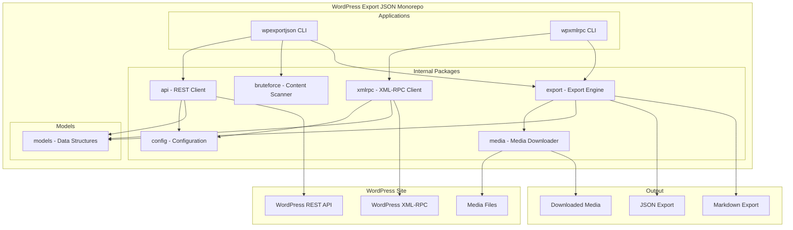
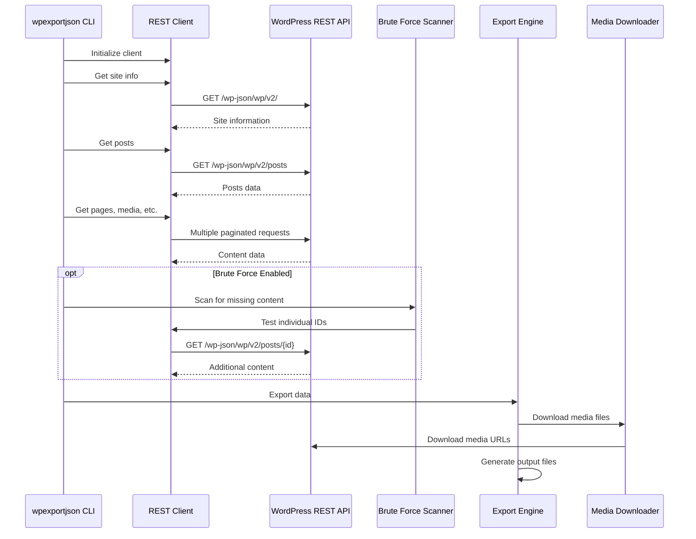
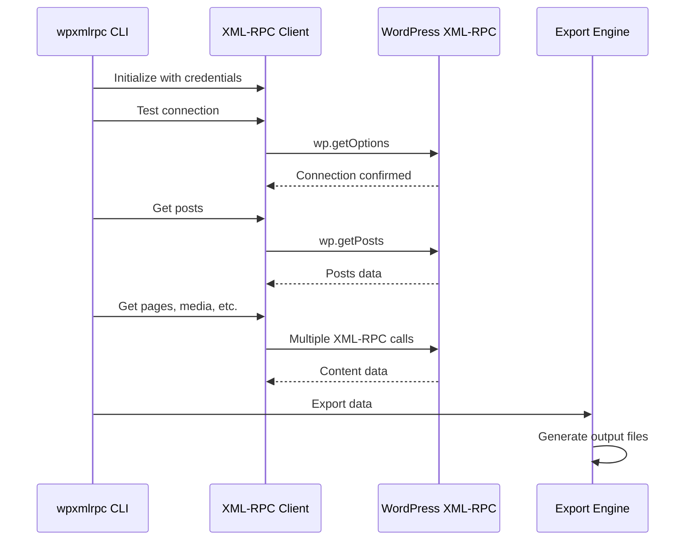

# WordPress Export JSON - Architecture Documentation

## System Overview

WordPress Export JSON is a monorepo containing two complementary applications for exporting WordPress content:

1. **wpexportjson** - REST API based exporter with brute force capabilities
2. **wpxmlrpc** - XML-RPC based exporter for authenticated access

## High-Level Architecture



## Component Architecture

### 1. Command Line Applications

#### wpexportjson
- **Purpose**: Primary application for WordPress content export
- **Protocol**: WordPress REST API
- **Features**: 
  - Public API access (no authentication required)
  - Brute force content discovery
  - High performance concurrent processing
  - Media download with progress tracking

#### wpxmlrpc  
- **Purpose**: Alternative exporter for authenticated access
- **Protocol**: WordPress XML-RPC
- **Features**:
  - Authenticated access to private content
  - Legacy WordPress support
  - User credential based authentication

### 2. Core Internal Packages

#### api Package
```go
type Client struct {
    config     *config.Config
    httpClient *resty.Client
    baseURL    string
}
```
- REST API client implementation
- Handles pagination automatically
- Supports concurrent requests
- Error handling and retries

#### xmlrpc Package
```go
type Client struct {
    config   *config.Config
    username string
    password string
    endpoint string
    blogID   int
}
```
- XML-RPC protocol implementation
- Authentication handling
- XML marshaling/unmarshaling
- Legacy WordPress compatibility

#### config Package
```go
type Config struct {
    URL           string
    Output        string
    Format        string
    BruteForce    bool
    MaxID         int
    DownloadMedia bool
    Concurrent    int
    // ... other fields
}
```
- Centralized configuration management
- Environment variable support
- File-based configuration
- Validation and defaults

#### export Package
```go
type Exporter struct {
    config     *config.Config
    downloader *media.Downloader
}
```
- Multi-format export engine
- JSON and Markdown output
- Media path resolution
- Content transformation

#### media Package
```go
type Downloader struct {
    config     *config.Config
    httpClient *http.Client
    mediaDir   string
    progress   *progressbar.ProgressBar
}
```
- Concurrent media downloading
- Progress tracking
- File deduplication
- Path sanitization

#### bruteforce Package
```go
type Scanner struct {
    config    *config.Config
    apiClient *api.Client
}
```
- ID enumeration scanning
- Concurrent content discovery
- Progress reporting
- Configurable limits

### 3. Data Models

#### Core WordPress Types
```go
type WordPressPost struct {
    ID              int
    Date            WordPressTime
    Title           RenderedContent
    Content         RenderedContent
    // ... other fields
}

type WordPressMedia struct {
    ID              int
    SourceURL       string
    MediaDetails    MediaDetails
    // ... other fields
}
```

#### Custom Types
```go
type WordPressTime struct {
    time.Time
}

func (wt *WordPressTime) UnmarshalJSON(data []byte) error {
    // Handles multiple WordPress date formats
}
```

## Data Flow Architecture

### REST API Export Flow



### XML-RPC Export Flow



## File System Architecture

### Project Structure
```
wpexportjson/
├── cmd/                    # Application entry points
│   ├── wpexportjson/      # REST API client
│   └── wpxmlrpc/          # XML-RPC client
├── internal/              # Internal packages
│   ├── api/               # REST API client
│   ├── xmlrpc/            # XML-RPC client
│   ├── config/            # Configuration management
│   ├── export/            # Export engine
│   ├── media/             # Media downloader
│   └── bruteforce/        # Brute force scanner
├── pkg/                   # Public packages
│   └── models/            # Data models
├── docs/                  # Documentation
├── build/                 # Build artifacts
├── dist/                  # Release binaries
└── export/                # Default export directory
```

### Export Output Structure

#### JSON Format
```
export/
├── export.json           # Complete export data
└── media/               # Downloaded media files
    ├── 1_image.jpg
    ├── 2_video.mp4
    └── ...
```

#### Markdown Format
```
export/
├── README.md            # Site information
├── posts/               # Individual post files
│   ├── 2024-01-01-post-title.md
│   └── ...
├── pages/               # Individual page files
│   ├── 2024-01-01-page-title.md
│   └── ...
├── media/               # Downloaded media files
│   ├── 1_image.jpg
│   └── ...
└── metadata.json        # Categories, tags, users
```

## Concurrency Architecture

### Worker Pool Pattern
```go
// Media downloader uses worker pools
jobs := make(chan models.WordPressMedia, len(mediaItems))
results := make(chan bool, len(mediaItems))

// Start workers
for i := 0; i < d.config.Concurrent; i++ {
    go d.worker(jobs, results)
}
```

### Brute Force Scanning
```go
// Concurrent ID scanning
for i := 0; i < s.config.Concurrent; i++ {
    wg.Add(1)
    go func() {
        defer wg.Done()
        for id := range jobs {
            // Process ID
        }
    }()
}
```

## Error Handling Architecture

### Layered Error Handling
1. **HTTP Level**: Connection errors, timeouts
2. **API Level**: HTTP status codes, rate limiting
3. **Data Level**: JSON parsing, validation
4. **Application Level**: Business logic errors

### Retry Strategy
```go
// Exponential backoff with jitter
for attempt := 0; attempt <= maxRetries; attempt++ {
    if success := operation(); success {
        return nil
    }
    time.Sleep(time.Duration(attempt+1) * time.Second)
}
```

## Security Architecture

### Authentication
- **REST API**: No authentication (public endpoints)
- **XML-RPC**: Username/password or application passwords
- **Media Downloads**: Follows WordPress authentication

### Data Protection
- No credential storage in configuration files
- Environment variable support
- HTTPS enforcement for XML-RPC

## Performance Considerations

### Optimization Strategies
1. **Concurrent Processing**: Configurable worker pools
2. **Pagination**: Automatic handling of large datasets
3. **Caching**: File existence checks for media
4. **Progress Tracking**: Real-time feedback
5. **Memory Management**: Streaming for large files

### Scalability Limits
- **REST API**: Rate limiting by WordPress
- **XML-RPC**: Generally slower than REST
- **Memory**: Proportional to content size
- **Disk**: Media files can be large

## Extension Points

### Adding New Export Formats
1. Implement format in `export` package
2. Add format validation in `config`
3. Update CLI flags and documentation

### Adding New Content Types
1. Define models in `pkg/models`
2. Add API methods in `api` or `xmlrpc`
3. Update export logic

### Custom Authentication
1. Extend `xmlrpc.Client` for new auth methods
2. Add configuration options
3. Update CLI interface

## Testing Architecture

### Unit Tests
- Individual package testing
- Mock HTTP clients
- Configuration validation

### Integration Tests
- End-to-end export testing
- WordPress test site setup
- Output validation

### Performance Tests
- Large dataset handling
- Concurrent operation testing
- Memory usage profiling
